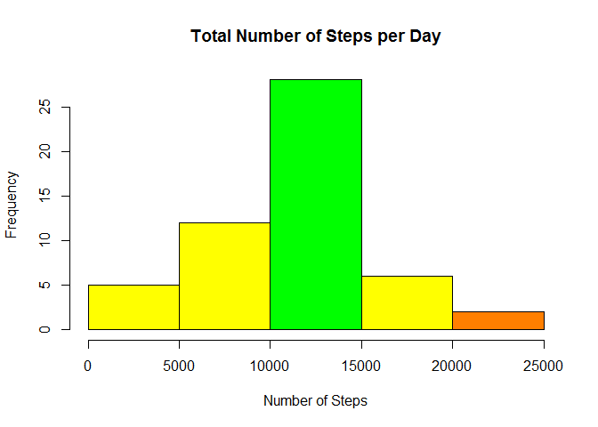
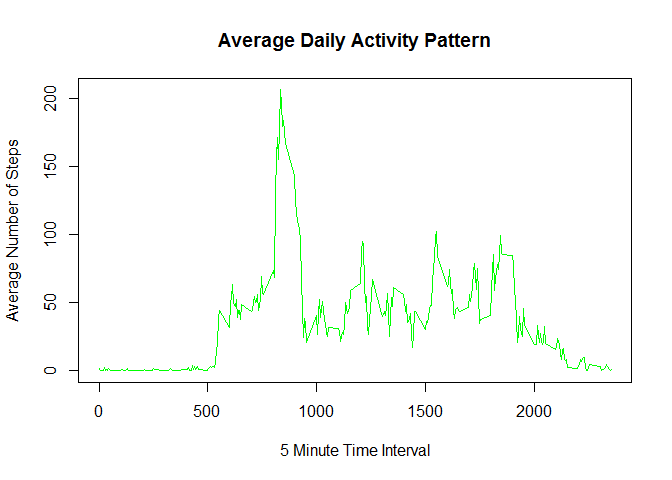
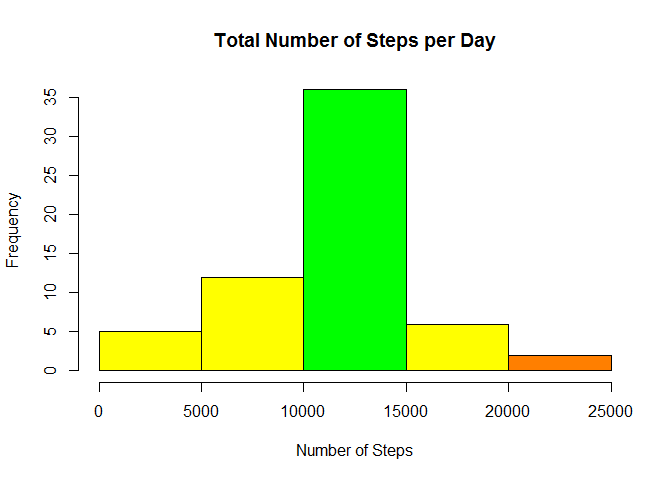
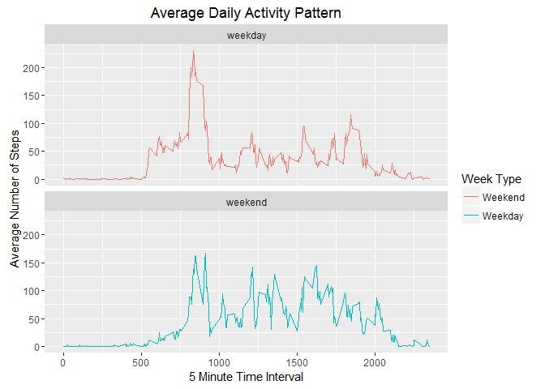

# Reproducible Research: Peer Assessment 1


## Loading and preprocessing the data


```r
#restore knitr package for output
library(knitr)
#restore lubridate package to make date objects
library(lubridate)
```

```
## Warning: package 'lubridate' was built under R version 3.2.3
```

```r
#restore ggplot2 package to make final plot
library(ggplot2)

url_add = "https://d396qusza40orc.cloudfront.net/repdata%2Fdata%2Factivity.zip"
        
#Create a temporary file, download, unzip and read in the data
temp <- tempfile()
download.file(url_add, temp, mode="wb")
unzip(temp, overwrite=TRUE)
act_data <- read.csv("activity.csv", header=TRUE)

valid_act <- act_data[complete.cases(act_data),]
```


## What is mean total number of steps taken per day?

```r
#Make a histogram of the total number of steps taken each day

#Aggregate sum of steps by date
sum_per_day <- aggregate(valid_act$steps, by=list(valid_act$date), sum)

#Create a device graphics window with the width and height as 680 pixels
# png(filename="plot1.png", width=680, height=680)
hist(sum_per_day$x, main="Total Number of Steps per Day", 
     xlab = "Number of Steps",
     col=c(rgb(255,255,0,max=255), rgb(255,255,0,max=255), rgb(0,255,0,max=255),
       rgb(255,255,0,max=255), rgb(255,127,0, max=255)))
```

\

```r
# dev.off()

#Calculate and report the mean and median total number of steps taken per day
#Print the summary to show the mean and median number of steps/day
summary(sum_per_day$x)
```

```
##    Min. 1st Qu.  Median    Mean 3rd Qu.    Max. 
##      41    8841   10760   10770   13290   21190
```


## What is the average daily activity pattern?

```r
#Make a time series plot (i.e. type = "l") of the 5-minute interval (x-axis) and #the average number of steps taken, averaged across all days (y-axis)

# png(filename="plot2.png", width=680, height=680)

#Create a data frame with only the interval and steps fields and calculate
#the mean of the steps separated by interval
steps_int_df <- data.frame(time = valid_act$interval, steps = valid_act$steps)
mean_per_day <- aggregate(steps_int_df, by=list(steps_int_df$time), mean)

plot(mean_per_day$time, mean_per_day$steps, type="l", 
     main="Average Daily Activity Pattern", 
     xlab="5 Minute Time Interval",
     ylab="Average Number of Steps",
     col="green")
```

\

```r
# dev.off()

#Which 5-minute interval, on average across all the days in the dataset, contains #the maximum number of steps? 
mean_per_day$time[which.max(mean_per_day$steps)]
```

```
## [1] 835
```
## Imputing missing values

```r
#Calculate and report the total number of missing values in the dataset (i.e. the #total number of rows with NAs)
sum(!complete.cases(act_data))
```

```
## [1] 2304
```

```r
#Devise a strategy for filling in all of the missing values in the dataset. The #strategy does not need to be sophisticated. For example, you could use the #mean/median for that day, or the mean for that 5-minute interval, etc.

#Copy the original data to a new variable and merge the mean_per_day data frame
#with the original data by time interval and replace the NAs with the mean values

#Create a new dataset that is equal to the original dataset but with the missing #data filled in.
act_data_all <- act_data
act_data_merge <- merge(act_data_all, mean_per_day, by.x = "interval", by.y = "time")
na_idx <- is.na(act_data_merge$steps.x)
act_data_merge$steps.x[na_idx] <- act_data_merge$steps.y[na_idx]

#Aggregate sum of steps by date
sum_per_day_all <- aggregate(act_data_merge$steps.x, by=list(act_data_merge$date), sum)

#Make a histogram of the total number of steps taken each day. 
# png(filename="plot3.png", width=680, height=680)
hist(sum_per_day_all$x, main="Total Number of Steps per Day", 
     xlab = "Number of Steps",
     col=c(rgb(255,255,0,max=255), rgb(255,255,0,max=255), rgb(0,255,0,max=255),
       rgb(255,255,0,max=255), rgb(255,127,0, max=255)))
```

\

```r
# dev.off()

#Calculate and report the mean and median total number of steps taken per day. Do these values differ from the estimates from the first part of the assignment? What is the impact of imputing missing data on the estimates of the total daily number of steps?
summary(sum_per_day_all$x)
```

```
##    Min. 1st Qu.  Median    Mean 3rd Qu.    Max. 
##      41    9819   10770   10770   12810   21190
```

## Are there differences in activity patterns between weekdays and weekends?

```r
#Create a new factor variable in the dataset with two levels -- "weekday" and "weekend" indicating whether a given date is a weekday or weekend day.

#Format date column as a date object and create a new column and populate
#with the days of the week
act_data_merge$date <- ymd(act_data_merge$date)
act_data_merge["weektype"] <- weekdays(act_data_merge$date)

#Find the indexes of the weekends and weekdays and populate the weektype column
#with the categories
weekend_idx <- act_data_merge$weektype %in% c('Saturday', 'Sunday')
act_data_merge$weektype[weekend_idx] <- "weekend"

week_idx <- !act_data_merge$weektype %in% c('weekend')
act_data_merge$weektype[week_idx] <- "weekday"

#Make a panel plot containing a time series plot (i.e. type = "l") of the 5-minute interval (x-axis) and the average number of steps taken, averaged across all weekday days or weekend days (y-axis). 

#Create a data frame with only the interval and steps fields and calculate
#the mean of the steps separated by interval
steps_int_df2 <- data.frame(time = act_data_merge$interval, 
                steps = act_data_merge$steps.x, 
                weektype = act_data_merge$weektype)

mean_per_day2 <- aggregate(steps_int_df2$steps, 
                by=list(steps_int_df2$time, steps_int_df2$weektype), mean)

# png(filename="plot4.png", width=680, height=680)
print(ggplot(mean_per_day2, aes(Group.1, x, color = Group.2))
    + geom_line()
    + facet_wrap(~Group.2, ncol=1, nrow=2)
    + ggtitle("Average Daily Activity Pattern") 
    + xlab("5 Minute Time Interval")
    + ylab("Average Number of Steps")
    + scale_colour_discrete(name="Week Type", 
                 labels=c("Weekend", "Weekday")))
```

\

```r
# dev.off()
```
